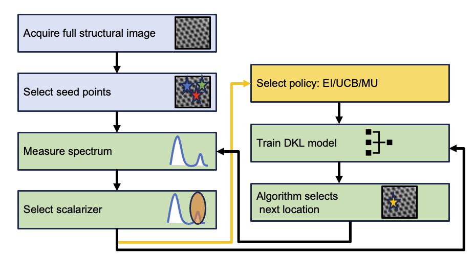

# Human-in-the-Loop: Automated Experiments (hAE)

## Paper : [Building Workflows for Interactive Human in the LoopAutomated Experiment (hAE) in STEM-EELS](https://arxiv.org/ftp/arxiv/papers/2404/2404.07381.pdf)

## Description

The concept of Human-in-the-Loop for Automated Experiments (hAE) represents an innovative approach to scientific research, blending human expertise with automated systems to optimize experimental processes. 

## How to run:
- clone the repository:
- cd hAE
- pip install .
- pip install atomai
- pip install pyroved
- try example data: !wget https://www.dropbox.com/s/nicyvttpihzh1cd/Plasmonic_sets_7222021_fixed.npy [update file path in example.yaml]
- python scripts/active_learning.py --config configs/example.yaml
- python scripts/full_dkl_benchmark.py --config configs/example.yaml
- python scripts/forensics.py --config configs/example.yaml
 
## coming soon: intervention notebooks

## Credits and References

- AtomAI:  [GitHub Repository](https://github.com/pycroscopy/atomai)
  
- AE-DKL:  [GitHub Repository](https://github.com/kevinroccapriore/AE-DKL)
  
- AE-PostExperimentAnalysis-DKL-BEPS:  [GitHub Repository](https://github.com/yongtaoliu/AE-PostExperimentAnalysis-DKL-BEPS)

